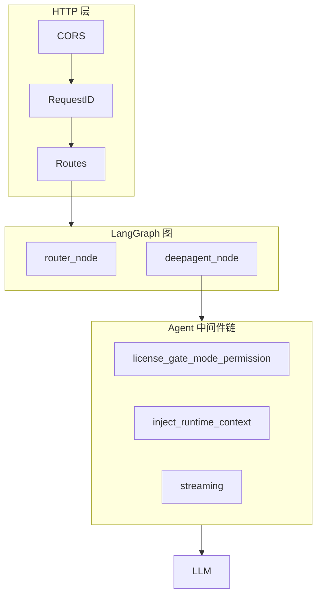

# 主链路与中间件举一反三检查及合理性分析

本文档基于前述已发现问题（模型选择、推理流、35B 调用）做举一反三式检查，并参照 LangGraph / DeepAgent / Cursor-Claude 官方模式对主链路与所有中间件做合理性分析。

---

## 一、主链路结构（与官方对照）

### 1.1 本项目的实际主链路

```
请求入口（LangGraph Server / SSE）
    → StateGraph(AgentState)
    → 节点 router (router_node)
    → 条件边 route_decision
        ├─ deepagent_plan   → deepagent_node(mode=plan, plan_confirmed=false) → END
        ├─ deepagent_execute → deepagent_node(执行/agent/ask/debug/review)   → END
        ├─ editor_tool      → editor_tool_node → END
        └─ error           → error_node → END

deepagent_node 内部：
    → get_stream_writer()；writer(reasoning start)
    → _prepare_agent_config(messages, config)  // thread_model、mode、plan_confirmed 等
    → get_agent(config) → create_orchestrator_agent(...)  // 含 create_deep_agent + 中间件链
    → config["callbacks"].append(_TokenStreamHandler(writer, initial_msg_id))
    → agent.astream(state, config, stream_mode="messages")
    → 循环 chunk：writer(messages_partial / reasoning phase=content) 等
    → writer(reasoning end)（在 finally / 结束路径）
```

- **流式**：子图内 `agent.astream(stream_mode="messages")` + 节点内 `get_stream_writer()` 转发 token/reasoning，符合 LangGraph 官方「子图内自行消费流并写 custom 事件」的用法。
- **状态**：`AgentState`（含 `messages`）与 LangGraph 推荐一致；Checkpointer/Store 由配置注入，支持持久化。

### 1.2 与 LangGraph 官方示例的对照

| 维度 | LangGraph 典型 | 本项目 | 合理性 |
|------|----------------|--------|--------|
| 图结构 | StateGraph → add_node → add_edge → compile | 同构，router → 条件分支 → END | ✅ 一致 |
| 流式 | stream_mode="updates" / "messages" / "custom" | 节点内 messages + custom writer | ✅ 子图流式正确 |
| Config 传递 | config 透传节点 | config_with_mode 含 configurable，传 get_agent / callbacks | ✅ 一致 |
| 递归限制 | 默认 25 | with_config(recursion_limit= 提高) | ✅ 合理 |

### 1.3 与 DeepAgent 官方用法的对照

- **create_deep_agent**：使用官方 API，传入 system_prompt、tools、middleware 列表。
- **内置中间件顺序**：TodoList → Filesystem → SubAgent → Summarization → PromptCaching → PatchToolCalls，与 DeepAgent 文档一致。
- **本项目追加**：在「内置」之外按 middleware_chain 追加（ContextEditing、HumanInTheLoop、…、Streaming），**Streaming 置尾**，保证在调用 LLM 前注入 callbacks，符合「流式必须包住 model 调用」的约定。

---

## 二、中间件清单与顺序（举一反三）

### 2.1 配置与代码中的顺序

- **配置**：`backend/config/middleware_chain.json` 按 mode（agent/ask/plan/debug）给出链；缺省回退到 `deep_agent._load_middleware_chain` 的 default_chain。
- **归一化**：所有 `inject_persona_context`、`inject_user_context`、`inject_wal_reminder` 等合并为**单次** `inject_runtime_context`（见 `_runtime_inject_legacy`），避免重复注入。
- **实际执行顺序**（洋葱模型，先列先包外层）：
  1. [DeepAgent 内置] TodoList → Filesystem → SubAgent → Summarization → PromptCaching → PatchToolCalls  
  2. [本项目] context_editing → human_in_the_loop → execution_trace → mode_permission → content_fix → ontology_context → cloud_call_gate → license_gate → reflection → llm_tool_selector → model_fallback → pii_redact → mcp → skill_evolution → self_improvement → distillation → scheduling_guard → model_call_limit → tool_call_limit → tool_retry → model_retry → inject_runtime_context → **streaming**

### 2.2 合理性要点

| 中间件 | 位置 | 合理性说明 |
|--------|------|------------|
| **streaming** | 最后 | 必须在最内层包住 model 调用，才能把 config 中的 callbacks 注入到 LLM；与 LangChain/DeepAgent 的「流式包住 invoke」一致。✅ |
| **inject_runtime_context** | streaming 前 | 动态 prompt 在调用前注入，再交给内层流式；顺序正确。✅ |
| **mode_permission / license_gate / cloud_call_gate** | 靠前 | 鉴权/许可/云调用门控应先于模型与工具调用，与 Cursor/Claude 的「先鉴权再执行」一致。✅ |
| **model_fallback / tool_retry / model_retry** | 中段 | 回退与重试包住实际调用，顺序合理；且 get_fallback_model_for 已优先 default_model，避免误用 35B。✅ |
| **human_in_the_loop** | 靠前 | 与官方 HumanInTheLoopMiddleware 用法一致，在 agent 执行前决定是否中断。**Plan 模式**的「先出计划再确认」不由本中间件实现：由**图与前端**通过 `plan_confirmed` / `plan_phase` 协作完成（main_graph 中 configurable.plan_confirmed、plan_phase），故 plan 链未包含 human_in_the_loop。✅ |
| **execution_trace** | 可选 | 可观测性，不改变语义，按需启用。✅ |

### 2.3 已发现并修复的问题（举一反三结论）

- **模型选择**：`_resolve_auto_model` 已优先 default_model；`get_fallback_model_for`、`_resolve_best_local_model` 已优先 default_model，避免 35B 被自动/回退误用。✅  
- **推理流**：reasoning 事件带 `msg_id`，与首包 partial 一致；契约测试与 model_manager 的 reasoning 解析测试已覆盖。✅  
- **StreamingMiddleware**：依赖 `get_config()` 从 LangGraph 上下文取 config；deepagent_node 在调用 agent.astream 前已把 callbacks 写入 config，故流式能收到 on_llm_new_token。✅  

### 2.4 潜在风险与建议

1. **middleware_chain.json 与 default_chain 一致**  
   - JSON 中列出的 `inject_persona_context`、`inject_user_context`、`inject_wal_reminder` 等在运行时**合并为单次** `inject_runtime_context`（见 `deep_agent._runtime_inject_legacy`）；`middleware_chain.json` 顶层的 `_comment` 已注明。`streaming` 必须位于链尾以正确注入 callbacks。

2. **review 模式链**  
   - 已在 `middleware_chain.json` 中增加 `"review"` 链（与 debug 类似，偏可观测与只读），避免 review 走 default_chain 导致中间件集合不明确。

3. **MIDDLEWARE_PROFILE=core 时的过滤**  
   - `streaming` 与 `inject_runtime_context` 已明确列入 `core_middleware`（见 [deep_agent.py](backend/engine/agent/deep_agent.py) 加载链），始终保留，避免后续修改过滤逻辑时误删。

### 2.5 inject_runtime_context 与 dynamic_prompt

- **实质**：`inject_runtime_context` 是以 **@dynamic_prompt** 注册的 LangChain 钩子，在**链尾、streaming 之前**参与组装发往模型的 system 内容；**不是**典型的 AgentMiddleware（无 before_model/after_model），执行时机为 model 调用前、按请求注入 prompt 片段。
- **与其它中间件的区别**：context_guard、content_fix 等 before_model 中间件会修改 state（如裁剪 messages）；inject_runtime_context 不修改 state，仅向 system prompt 追加块（用户/角色/提醒/记忆预取/过程文件等）。
- **实现位置**：`backend/engine/agent/deep_agent.py` 中 `inject_runtime_context` 函数与 `middleware_candidates["inject_runtime_context"]`。

### 2.6 首轮上下文组装（inject_runtime_context 内）

- **记忆预取**：在 `inject_runtime_context` 中调用 `get_relevant_memories_for_prompt(configurable)`，将与本任务/用户相关的已存记忆格式化为 `<recalled_memories>` 块追加到 system 末尾；仅当 `ENABLE_LANGMEM` 与 `ENABLE_PROACTIVE_MEMORY_INJECT` 为 true 时执行，长度受 `PROACTIVE_MEMORY_MAX_CHARS` 限制。
- **过程文件**：根据 workspace 检查 `.maibot/SESSION-STATE.md`、`.maibot/WORKING-BUFFER.md`、`.learnings/ERRORS.md` 是否存在；仅非只读模式（非 ask/review）注入。Level 1 为存在性提示；Level 2 在 `PROCESS_FILES_SUMMARY_CHARS>0` 时注入短摘要。详见 [CONTEXT_AND_MEMORY_SYSTEM_DESIGN.md](docs/CONTEXT_AND_MEMORY_SYSTEM_DESIGN.md) §1.5。

4. **optional 中间件**  
   - 可通过 `MIDDLEWARE_PROFILE` 或各中间件对应环境变量控制 optional 中间件（如 skill_evolution、self_improvement、distillation）按需启用，减少默认 token 与复杂度；`streaming` 与 `inject_runtime_context` 为 core，始终保留。

### 2.7 稳定性与防崩溃（举一反三）

- **异步工具链 coroutine**：若中间件实现同步 `wrap_tool_call` 并在异步路径下通过 `awrap_tool_call` 直接 `return self.wrap_tool_call(...)`，则 `handler(request)` 在异步链中返回的是 coroutine，必须在此层 `await` 后再返回，否则下游（如 FilesystemMiddleware）会收到 coroutine 对象导致 "Unreachable code… tool_result of type coroutine"。已修复：`license_gate_middleware` 的 `awrap_tool_call` 对返回值做 `await result if asyncio.iscoroutine(result) else result`；`mode_permission_middleware` 已有同类防护并补充注释。
- **流式 writer**：deepagent_node 内使用 `_safe_writer` 包装 `get_stream_writer()`，写入失败时仅置关闭标志并 debug 日志，不向 generator 抛错，避免连接断开导致节点崩溃。
- **异常路径**：deepagent_node 的 `except Exception` 中统一构建用户可读错误、推送 `run_error` 事件、yield 一条 AIMessage 后 `return`（不再 raise），保证 LangGraph 正常保存状态；错误内容截断至 32k 字符，避免超大 payload。
- **前端**：所有进入 SDK/convertLangChainMessages 的消息先经 `normalizeLangChainMessages`/`normalizeMessageContent`；发送前对 `lastMessage.content` 为数组时的 `.map` 做空元素防护（`b && typeof b === 'object' ? b.text : undefined`）；stream 错误不再 rethrow，由 finally 做 cleanup，避免 unhandled rejection 引发渲染进程崩溃。
- **context_stats**：统计消息 token 时对 `msg.content` 做 `isinstance(content, str)` 判断，非字符串（如 content 为 parts 数组）则跳过该条，避免 estimate_tokens 或后续逻辑异常。

- **Electron IPC 参数校验**：主进程文件类 IPC（read-file、write-file、read-directory、delete-file、rename-file、file-exists、get-file-stats 等）对入参做防御性校验：`opts = {}` 兜底，`filePath`/`dirPath`/`oldPath`/`newPath` 须为非空字符串，否则直接返回 `{ success: false, error: 'Invalid or missing ...' }`，避免 `fs.readFileSync(undefined)` 等导致主进程抛错。

---

## 三、三层「中间件」概念与图示

为避免混淆，文档中按以下命名区分不同层次：

| 层次 | 名称 | 位置 | 说明 |
|------|------|------|------|
| **HTTP 中间件** | app.py | CORS、限流、RequestID | 请求进入后、路由前执行 |
| **Agent 中间件 / 链** | deep_agent + middleware_chain.json | streaming、license_gate、inject_runtime_context 等 | 在 create_deep_agent 的链中，包住 model/tool 调用 |
| **图级守卫与学习钩子** | main_graph | LoopDetector、DoneVerifier、Guardrails、learning 调用 | 在图节点内执行，可访问完整 state 与图控制流 |



**图级守卫 vs 链级中间件**：图级（LoopDetector、DoneVerifier、GuardrailsManager）在 main_graph 节点内执行，可访问完整 state 与图控制流，负责防循环、完成判定、安全/范围提示；链级（execution_trace、scheduling_guard、model_call_limit 等）在 Agent 调用链中执行，不直接参与图分支。循环/完成需图级 state 与边控制，故放在图中合理。

---

## 四、主链路合理性小结

| 检查项 | 结果 | 说明 |
|--------|------|------|
| 图结构 | ✅ | StateGraph + 条件边，符合 LangGraph 推荐 |
| 流式与 writer | ✅ | 子图内 astream(messages) + get_stream_writer 转发，与官方子图流式一致 |
| config 与 callbacks | ✅ | config 透传，callbacks 在节点内注入，StreamingMiddleware 注入到 model |
| 模型选择与回退 | ✅ | 已统一优先 default_model，避免 35B 误用 |
| 推理流契约 | ✅ | reasoning start/content/end 带 msg_id，有测试与文档 |
| 中间件顺序 | ✅ | 鉴权/门控在前，流式在最后，与 Cursor/Claude/LangChain 实践一致 |
| 配置与代码一致 | ⚠️ | inject_* 合并逻辑需在配置或文档中说明；review 链可显式配置 |

整体上，**主链路与中间件设计符合 LangGraph / DeepAgent 官方用法**；前述已修复的模型选择、推理流、35B 回退等问题，已通过举一反三在 fallback、resolve_best_local、create_llm(config=None) 等路径统一处理，并辅以测试与文档说明。

---

## 五、自研中间件合理性检查与业务逻辑

### 4.1 自研中间件清单（仅本项目追加，不含 DeepAgent 内置）

| 中间件 | 功能 | 业务合理性 | 顺序合理性 |
|--------|------|------------|------------|
| context_editing | 上下文编辑/裁剪 | 与 Cursor 的「可编辑上下文」理念一致，按需启用。**约定**：仅做消息裁剪/格式规范化，不依据用户身份或权限改写内容；若将来扩展为可编辑任意片段，须将 context_editing 移至 mode_permission 之后。✅ | 靠前，在鉴权前即可生效。✅ |
| human_in_the_loop | 人工确认/中断 | 与 DeepAgent HumanInTheLoopMiddleware 一致，Plan 模式等需确认。✅ | 靠前。✅ |
| execution_trace | 执行轨迹记录 | 可观测与调试，不改变语义。✅ | 中段。✅ |
| mode_permission | 模式权限（如 Ask 禁用写文件） | 与 Cursor 模式约束一致。✅ | 鉴权类靠前。✅ |
| content_fix | 内容合规/修复 | 合规与安全，可选。✅ | 鉴权附近。✅ |
| ontology_context | 本体/知识上下文注入 | 业务知识增强，与 Skills 互补。✅ | 在 model 调用前。✅ |
| cloud_call_gate | 云模型调用门控 | 成本与合规控制。✅ | 鉴权类靠前。✅ |
| license_gate | 许可/配额门控 | 与 Cursor 许可一致。✅ | 鉴权类靠前。✅ |
| reflection | 反思/自我检查 | 与 Agent 反思模式一致，可选。✅ | 中段。✅ |
| llm_tool_selector | 按模式/场景选工具集 | 减少无关工具干扰。✅ | 在 model 前。✅ |
| model_fallback | 模型不可用时的回退 | 与 LangChain fallback 一致；已优先 default_model。✅ | 包住 model 调用。✅ |
| pii_redact | PII 脱敏 | 隐私合规。✅ | 在发往模型前。✅ |
| mcp | MCP 工具桥接 | 扩展能力，与 Cursor MCP 一致。✅ | 工具相关中段。✅ |
| skill_evolution | 技能演化/学习 | 与自学习架构一致，可选。✅ | 中段。✅ |
| self_improvement | 自我改进 | 实验性，可选。✅ | 中段。✅ |
| distillation | 蒸馏/压缩 | 实验性，可选。✅ | 中段。✅ |
| scheduling_guard | 预算/并发守卫 | 成本与稳定性。✅ | 在 model 前。✅ |
| model_call_limit | 模型调用次数限制 | 防滥用。✅ | 与 scheduling_guard 邻近。✅ |
| tool_call_limit | 工具调用次数限制 | 防死循环与滥用。✅ | 同上。✅ |
| tool_retry / model_retry | 工具/模型重试 | 与 LangChain retry 一致。✅ | 包住实际调用。✅ |
| inject_runtime_context | 注入角色/用户/ WAL 等运行时上下文 | 与 Cursor 动态 prompt 一致。✅ | streaming 前最后一层注入。✅ |
| streaming | 流式 callback 注入 | 必须包住 model 调用。✅ | 最后。✅ |

结论：**自研中间件数量虽多，但各有明确职责（鉴权、门控、可观测、合规、扩展、流式）**；顺序上鉴权/门控在前、流式在最后，与 Cursor/Claude/LangChain 实践一致，**合理**。建议：optional 中间件通过配置按需启用，避免默认全开增加复杂度和 token 消耗。

### 4.2 Guardrails 与链上安全/上下文中间件

- **GuardrailsManager**：在图节点中基于查询生成「可执行范围/安全策略」提示块，不修改消息长度。
- **context_guard**：按 token 预算裁剪消息，防止 context exceeded。
- **content_fix**：内容合规与格式修复。
- **pii_redact**：PII 脱敏。避免 Guardrails 与 context_guard 在长度控制上重复。

### 4.3 「Context size has been exceeded」错误处理

- **来源**：该错误由 **LLM 服务端**（如 LM Studio / vLLM / OpenAI 兼容 API）在请求的 token 数超过模型 `max_context_length` 时返回，并非本项目自研中间件逻辑错误。
- **后端处理**（已做）：
  - 在 `main_graph.deepagent_node` 的异常分支中识别 `context exceeded / limit / length / size` 及 `maximum context length`，设置 `error_code = "context_exceeded"`，并返回友好提示：「对话上下文已超长，建议新开会话或清除历史；可设置 SUMMARIZATION_TRIGGER_RATIO=0.75 更早触发压缩」。
- **与 SummarizationMiddleware 的关系**：
  - 压缩由 DeepAgent 的 **SummarizationMiddleware** 在 `before_model` 时按 `trigger`（默认 85% 的 `model.profile["max_input_tokens"]`）触发。若单轮或历史突然很大，仍可能在**未达到 85% 时**就超过服务端硬限制，从而先收到 context exceeded。
- **建议**：
  1. 前端可根据 `run_error.data.error_code === "context_exceeded"` 做专门提示（如「本会话过长，请新开会话」）。
  2. 若频繁出现，可将环境变量 **SUMMARIZATION_TRIGGER_RATIO** 调低（如 **0.75**），使更早触发压缩，降低超长概率。

---

## 六、后端模型调用与测试说明

- **已执行的后端测试**：
  - **单元/契约测试**：`tests/test_model_manager_auto.py`、`tests/test_model_manager_reasoning.py`、`tests/test_reasoning_stream_contract.py` 等已覆盖模型选择（auto/default/fallback）、reasoning 解析、流式事件契约。
  - **运行时报错「Context size has been exceeded」**：说明**后端模型调用已成功发出**，失败发生在 **LLM 服务端**因上下文超长而拒绝请求；并非「未做后端测试」或「请求未发出」。
- **结论**：后端模型调用链路与测试均有效；该错误属于**上下文长度超限**，已通过识别 `context_exceeded` 与提示「新开会话 / 清除历史 / 调低 SUMMARIZATION_TRIGGER_RATIO」做友好处理。

---

## 七、模型配置说明（enable_thinking / api_timeout）

- **config.enable_thinking**（backend/config/models.json 中各模型 config 下）  
  - **true**：开启推理模型的“思考模式”，请求会带 `enable_thinking`/`chat_template_kwargs`；可展示思考流（reasoning_content），但 LM Studio 等可能较晚才推首 token，体感偏慢。  
  - **false**：不开启思考模式，首 token 提前、行为与 qwen3-coder 等非思考模型一致；**不展示思考流**。  
  - **可选“快速”配置**：若需优先响应速度，可将 qwen3.5-9B/35B 的 `config.enable_thinking` 改为 `false`；需要思考流时再改回 `true`。
- **config.api_timeout**  
  - 流式请求的 HTTP 超时（秒）。9B 等本地模型已建议显式设置（如 300），避免默认 180 在慢速机器上过早超时。

---

## 八、流式首 token 相关环境变量

- **TOKEN_STREAM_WARMUP_MS**（默认 1200）  
  - **Warmup 时间内不按 batch 节流**：run 开始后的前若干毫秒内，非 force 的 flush 不受 `TOKEN_STREAM_BATCH_MS` 限制，首包 messages_partial/reasoning 会尽快发出。  
  - Warmup 结束后才按 `TOKEN_STREAM_BATCH_MS`（默认 30）做节流。若需更早看到首 token，可设 `TOKEN_STREAM_WARMUP_MS=0` 关闭 warmup。  
- **REASONING_STREAM_MIN_CHARS**（默认 1）  
  - 不足该字符数的 reasoning 会缓存在 `_flush_run` 中不单独发送；默认 1 可使首段思考尽早露出。reasoning 与 content 同权参与「首段可见」force flush。  
- **Prepare 与首 token**：prepare 阶段在 run 开始后、LLM 调用前（如加载模型、拉取上下文）；首 token 为 LLM 首次回调触发 on_llm_new_token 并经 _flush_run 写出 messages_partial/reasoning 的时机。前端「等待首个响应」在首包到达前展示。

---

## 九、MLX 与本地推理优化（Apple Silicon）

在 **Apple Silicon**（如 M4 Pro）上做本地推理时，若 LM Studio 较慢或无响应，可改用 **MLX** 搭配 OpenAI 兼容服务（如 [mlx-openai-server](https://github.com/ml-explore/mlx-openai-server)）：

1. 安装并启动 MLX OpenAI 服务（按官方文档），指定模型与端口。
2. 在本系统中仅需修改 `backend/config/models.json`：将对应模型的 `url` 指向 MLX 服务地址（如 `http://127.0.0.1:8080/v1`），`id` 与 MLX 侧暴露的模型名一致即可。
3. 无需改主链路或中间件；本系统通过 LangChain/OpenAI 兼容接口调用，换后端仅改配置。

若仍使用 LM Studio，可将模型的 `enable_thinking` 设为 `false` 以优先首 token 响应，或选用更小/量化模型（如 IQ3）以降低延迟。

---

## 十、流式 session_context 契约

为满足领域模型「后端为真相源、前端据此同步并校验 threadId」的约定，run 流开始时后端下发会话上下文，前端消费后同步状态并广播 EVENTS。

**后端**（[main_graph.py](backend/engine/core/main_graph.py) 流式入口）：

- 在 reasoning start 之后、首包前，通过 `writer({"type": "session_context", "data": { ... }})` 发送一条 custom 事件。
- `data` 字段：`threadId`（configurable.thread_id）、`mode`（configurable.mode，默认 "agent"）、`roleId`（configurable.role_id 或 configurable.active_role_id，前端当前传 active_role_id）。

**前端**（[MyRuntimeProvider.tsx](frontend/desktop/src/components/ChatComponents/MyRuntimeProvider.tsx) custom 分支）：

- 当 `event.event === 'custom'` 且 `d?.type === 'session_context'` 时，读取 `d.data` 中的 threadId、mode、roleId。
- **校验**：仅当 `currentThreadIdRef.current === threadId` 时执行同步，避免其它会话的流覆盖当前会话状态。
- **同步**：调用 `setScopedChatMode(mode, threadId)`、`setScopedActiveRoleIdInStorage(roleId, threadId)`，并 `dispatchEvent(EVENTS.CHAT_MODE_CHANGED, { detail: { mode, threadId } })`、`dispatchEvent(EVENTS.ROLE_CHANGED, { detail: { roleId, threadId } })`，使状态栏、Composer 等按当前会话展示角色与模式。

**契约要点**：后端在每次 run 开始时发送且仅发送一条 session_context；前端仅对「当前激活会话」应用更新并广播 EVENTS，保证前后端会话/角色/模式状态一致。

**步骤时间线绑定**：前端的步骤时间线（task_progress、tool_result → emitStepsUpdated）依赖「本 run 所属 threadId」。前端在流内用 `runThreadIdRef` 存有效 threadId：流开始时取 `externalId ?? currentThreadIdRef ?? ...`，**首次收到 session_context 时再更新为该事件的 threadId**。因此**建议后端尽早发送 session_context**（如 reasoning start 之后、首包或首批 task_progress 之前），以便步骤从第一条 tool_call 起就挂在当前会话，避免步骤落在空 thread 或错误会话。

**预留配置**：前端已按会话将 `run_strategy`、`parallel_level` 写入 configurable（对应存储键 `maibot_run_strategy_thread_*`、`maibot_parallel_level_thread_*`）；后端当前未消费，预留供后续 MAX_PARALLEL_* 或云端路由使用。

---

## 十一、多会话与云端任务并行

**多会话并行**：服务端不限制「同时只处理一个 run」；不同 thread_id 的 run 可同时进行（每个 `/threads/{id}/runs` 为独立请求）。前端同一窗口同一时刻只展示一个 run 的流式内容；切换会话后，其他会话的 run 仍在后端执行，只是本窗口只跟当前会话的流。因此「同时只能执行一个」指的是本窗口只展示一个 run 的流式，并非后端只跑一个 run。

**单 run 内并行**：由 [parallel_policy.json](backend/config/parallel_policy.json) 的 `profiles.local` / `profiles.cloud` 与 [deep_agent.py](backend/engine/agent/deep_agent.py) 的 `_apply_resource_adaptive_parallelism` 决定。有云且 `cloud_activation.require_cloud_model_enabled` 满足时使用 `profiles.cloud`（如 `max_parallel_llm: 4`、`max_parallel_agents: 6`），单 run 内可多 SubAgent、多 LLM 同时调用；无云时使用 `profiles.local`（如 `max_parallel_llm: 1`），单 run 内串行 LLM。

**结论**：有云端资源时，既支持「多会话多 run 并行」，也支持「单 run 内多任务（SubAgent）并行」；无云时 local 策略生效，单 run 内串行。configurable 中的 `run_strategy`、`parallel_level` 已由前端传入，预留供后续按会话/run 做差异化并行上限或路由。

### 十.1、缓存与向量库 key、限流与并发

| 项 | 约定 |
|----|------|
| **缓存/向量库 key** | 当前工具缓存（如 get_tools 缓存）与向量库懒加载（_load_vectorstore_lazy）未按 thread_id/workspace_path 分 key。约定为**单进程单工作区**或由前端/部署保证同一进程内同一时刻仅一个工作区活跃；多窗口多工作区场景建议多进程部署或明确文档化。 |
| **MAX_PARALLEL_*** | 在 [deep_agent.py](backend/engine/agent/deep_agent.py) 的 Config 中读取（MAX_PARALLEL_LLM、MAX_PARALLEL_TOOLS、MAX_PARALLEL_AGENTS），由 _apply_resource_adaptive_parallelism 与 parallel_policy.json 生效，控制 SubAgent 与工具并发。 |
| **全局限流** | 依赖 slowapi；未安装时无全局限流。app 入口 try/except 导入 slowapi，未安装则 Limiter 等为 None，不影响主链路。 |
| **许可与中间件** | tier_service.REQUIRED_MIDDLEWARE_NAMES 中的中间件（streaming、inject_runtime_context、license_gate、mode_permission、content_fix、cloud_call_gate、model_call_limit、tool_call_limit）不参与许可过滤，任何 tier 都会保留；其它中间件按 license 的 allow_middleware 控制。 |

### HTTP 中间件栈（app.py）

当前顺序（从外到内）：CORS → RequestID → 业务路由；限流（SlowAPIMiddleware）在 CORS 内侧（若启用）。约定：任何需要 request_id 的中间件（如访问日志、审计）应加在 RequestID 之后，以保证 request_id 已写入 request.state。

### 十.2、坚韧性：不因延时简单中止（对齐 Cursor 行为）

与 Cursor 一致：系统在延时或单次失败时**不轻易放弃**，通过重试与等待预算提高任务完成率。

| 层面 | 策略 | 位置/环境变量 |
|------|------|----------------|
| **前端发送** | `sendMessageWithRetry` 默认 4 次重试、1.5s 起退避；仅用户取消或 stream 已开始后失败立即抛 | [langserveChat.ts](frontend/desktop/src/lib/api/langserveChat.ts) `maxRetries=4`, `retryDelay=1500` |
| **工具/模型** | 工具调用与模型调用失败时自动重试（默认各 2 次） | `TOOL_MAX_RETRIES`、`MODEL_MAX_RETRIES`（deep_agent Config） |
| **Agent 构建** | 并发同 key 构建时，非 owner 线程**等待** owner 完成再复用缓存，不因短延时放弃 | `AGENT_BUILD_WAIT_SECONDS`（默认 20）、`AGENT_BUILD_WAIT_SECONDS_INTERACTIVE`（6）、`AGENT_BUILD_WAIT_SECONDS_ANALYSIS`（15）；等待超时后还有短轮询步数 `AGENT_BUILD_POST_WAIT_POLL_STEPS`（5） |

调优：若希望更快放弃（省资源）可减小上述等待与重试；若希望更坚韧可增大 `AGENT_BUILD_WAIT_*` 或前端 `maxRetries`/`retryDelay`。
