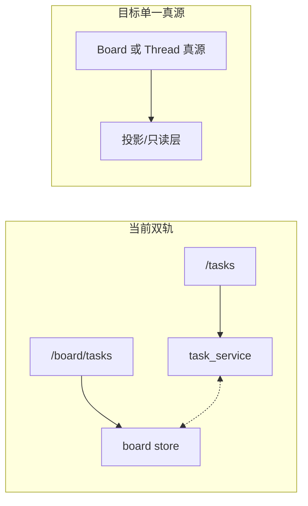

# 下一阶段执行规划（2026-03-02）

本文档在 [Claude/Cowork/Cursor 兼容改造执行清单](claude_cowork_cursor_compat_execution_plan_2026-03-02.md) 基础上，明确 P0/P1/P2 的完成状态、优先级与验收标准，便于按序实施。

## 当前状态

- **已完成**：季度对齐（会话总线、知识摄入、API 边界、知识观测、检索体验）；plugins/skills compat smoke 与 CI 门禁；任务状态投影与 wiring 检查（`TASK_STATUS_AUTHORITY=board`、`project_board_task_status` 单写入口）；Plan 由图级 `plan_confirmed` 控制；前端 Plan 确认通过 configurable 传递，且 check 禁止 `maibot_plan_confirmed_thread_` 等多源输入。
- **双轨仍存**：任务数据仍有 `/tasks`（thread 维）与 `/board/tasks`（board 维）两套读写路径；`task_service` 与 board store 的同步依赖 `sync_board_task_by_thread_id` 与 `update_task_status_sync`，需收敛为单一真源。

---

## 阶段一（M1 收尾）：P0 必须项

### P0-1 任务状态单一真源

| 项 | 说明 |
|----|------|
| **范围** | 确定 Task 唯一真源（Board 或 Thread），将 `/tasks` 的读写收敛为对真源的投影或代理；移除或灰度双轨同步逻辑。 |
| **关键文件** | `backend/engine/tasks/task_service.py`、`backend/engine/tasks/task_bidding.py`（`project_board_task_status`、`sync_board_task_by_thread_id`）、`backend/api/app.py`（`/tasks` 与 `/board/tasks` 路由）。 |
| **验收** | 同一任务在 `/tasks`、`/board/tasks`、执行日志三处状态一致；`check_task_status_wiring` 与 `test_task_status_projection_e2e` 仍通过。 |
| **依赖** | 当前已有 `TASK_STATUS_AUTHORITY`、`_TASK_SINGLE_SOURCE_ENABLED`，可在此基础上做「Board 为唯一写入口、Thread 只读投影」的固化与测试。 |

### P0-2 Plan 确认语义收敛

| 项 | 说明 |
|----|------|
| **范围** | 确认无任何「文本启发式」或 localStorage 直读作为执行依据；仅 `configurable.plan_confirmed=true` 触发执行。 |
| **关键文件** | `backend/engine/core/main_graph.py`、`backend/engine/middleware/mode_permission_middleware.py`；前端 `frontend/desktop/src/components/ChatComponents/thread.tsx`、`tool-fallback.tsx` 仅写 configurable，不写多源。 |
| **验收** | 回归用例覆盖「未传 plan_confirmed 或为 false 不执行」；现有 `test_mode_permission_plan_no_block` 可扩展。 |

### P0-3 后端会话事件协议（可选收尾）

| 项 | 说明 |
|----|------|
| **范围** | 前端跨窗口同步已做（sessionState、role、chat_mode）；若需后端主动推送或审计，可在 `app.py` 增加事件发布点（如任务状态变更、模式切换回调），供前端或审计消费。 |
| **验收** | 事件可追踪、与前端 CustomEvent 协议对齐；非必须可放在 P2。 |

---

## 阶段二（M2）：P1 兼容能力

| 编号 | 任务 | 主要改动位置 | 前置条件 | 验收标准 |
|------|------|--------------|----------|----------|
| P1-1 | 插件 manifest 强校验（Schema + 版本门禁） | `backend/engine/plugins/spec.py`、`backend/engine/plugins/plugin_loader.py` | — | 非法 manifest 安装失败且给出明确错误；`min_version` 可硬拦截。 |
| P1-2 | 安装/升级/回滚闭环（下载-校验-原子切换） | `backend/engine/plugins/plugin_registry.py`、`backend/api/app.py`、前端插件管理入口 | P0-1 完成后再动任务相关 API 时注意兼容 | `/plugins/install`、`/plugins/sync`、`/plugins/update` 可回放；失败可回滚；版本可追踪。 |
| P1-3 | plugin agents/hooks/.mcp.json 执行面打通 | `backend/engine/plugins/plugin_loader.py`、`backend/tools/mcp/mcp_tools.py`、运行时注入链 | — | 插件声明的 agent/hook/mcp 可实际执行并可观测。 |
| P1-4 | skills 统一索引（注入可用=管理可见） | `backend/engine/skills/skill_registry.py`、`backend/tools/skills_tool.py` | — | `list_skills/match_skills` 与运行时可用 skills 一致。 |

---

## 阶段三（M3）：P2 稳定性与规模化

| 编号 | 任务 | 主要改动位置 | 依赖 | 与现有能力整合 |
|------|------|--------------|------|----------------|
| P2-1 | 统一观测面板（trace/task/session/mode/tool） | 前端观测页、`systemApi` 指标聚合接口、后端指标上报点 | P1 观测埋点 | 与 `release-readiness`、`build-unified-observability-snapshot` 对齐。 |
| P2-2 | 兼容矩阵 CI（插件+skills 回放） | `.github/workflows/ci.yml`、`backend/scripts/*_e2e.py`、前端 check 脚本 | P1 闭环 | 与 `ops_daily_check`、`check_ci_release_gates` 分层运行。 |
| P2-3 | 知识来源治理与可追溯策略 | `knowledge_base` 流程文档、kb 工具链、配置模板 | — | 与 `build-knowledge-pipeline-snapshot`、知识检索 metadata 衔接。 |

---

## 优先级与顺序建议

1. **先做 P0-1**（任务单一真源），再做 **P0-2**（Plan 回归加固）；P0-3 视是否需要后端事件推送再排期。
2. **P1** 在 P0 验收通过后按 **P1-2 → P1-3 → P1-4** 顺序（P1-1 已部分完成）。
3. **P2** 在 P1 关键闭环完成后启动，P2-1/P2-2/P2-3 可依资源并行或串行。

---

## 架构关系简图

---

## 执行说明

- 实施时按上述优先级逐项推进，每项完成后跑齐 `check_task_status_wiring`、`test_task_status_projection_e2e`、`plugins-compat-smoke`、`skills-compat-smoke` 及 `check_ci_release_gates`，再进入下一项。
- 兼容清单与本规划不一致时，以本规划为准；清单可仅保留高层次的里程碑与对外口径。
