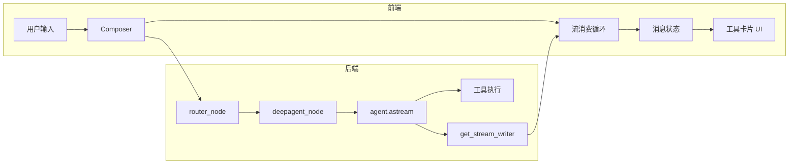

# 用户任务全链路处理分析与优化

## 一、全链路概览

### 1.1 请求到响应的步骤

| 阶段 | 位置 | 说明 |
|------|------|------|
| 1 入口 | 前端 Composer / LangGraph sendMessage | 用户消息 + configurable（thread_id, mode, workspace_path 等） |
| 2 路由 | main_graph router_node | 根据 body 决定 deepagent_plan / deepagent_execute / editor_tool / error |
| 3 执行 | deepagent_node | 设置 workspace_root → get_agent(config) → agent.astream(state, config, stream_mode="messages") |
| 4 流式 | DeepAgent 内部 | LLM 产出 AIMessage（content + tool_calls）→ 框架执行工具 → 产出 ToolMessage → 作为 chunk 回传 |
| 5 转发 | main_graph 循环 | 消费 astream 的 chunk：ai → 发 messages_partial（content/tool_calls）；tool → 发 subagent_end / task_progress(todos)，**此前未发通用 tool 结果** |
| 6 前端 | MyRuntimeProvider | custom(messages_partial) → normalizeToolCallsInMessages → yield messages/partial → 消息状态更新 |
| 7 展示 | thread.tsx / tool-fallback.tsx | 根据 message.content 中 tool-call  part 的 status（running/complete）与 result 渲染工具卡片 |

### 1.2 模型返回解析

- **AIMessage**：content（str 或 list）、tool_calls（id/name/args）由 LangChain/LangGraph 解析；main_graph 中通过 `getattr(msg, "tool_calls", None)` 与 `_tc_dict` 规范化后写入 messages_partial，**解析正确**。
- **ToolMessage**：tool_call_id、name、content 由框架填入；content_fix_middleware 对 tool_call_id 补全与过长 content 截断（max 30000 字符），**解析与防护合理**。
- **潜在点**：tool_call_chunks 与 tool_calls 并存时，前端 normalizeToolCallsInMessages 仅做 name/id 补全，不生成「部分 tool_call」的中间状态；若后端只发 chunk 未发完整 tool_calls，前端可能缺少 name。当前后端在 callback 中同时发 tool_calls 与 tool_call_chunks，**行为一致**。

---

## 二、可优化与完善点

### 2.1 工具执行结果的即时展示（Cursor 式）

- **现状**：task 和 write_todos 在 ToolMessage 到达时有专用事件（subagent_end、task_progress）；其余工具（read_file、grep、web_search 等）**没有**「工具完成 + 结果摘要」的独立事件，前端只能等 messages_partial 合并进 ToolMessage 后才显示完成和结果。
- **对比 Cursor**：Cursor 能实时看到「执行了 X → 结果如何」的流式体验；本项目对 python_run / read_file 已有细粒度事件（python_output、file_read_progress 等），但通用工具缺少「完成 + 结果摘要」事件。
- **优化**：在 main_graph 处理每条 ToolMessage 时，**统一发送 `tool_result` 事件**（tool_call_id、tool、result_preview），前端可据此立即展示「工具 X 完成：<摘要>」，与 Cursor 体验对齐。

### 2.2 冗余与重复步骤

- **middleware 链**：context_editing、inject_runtime_context 等已合并为单次注入，无重复；streaming 置尾，**无画蛇添足**。
- **双通道（custom vs messages/partial）**：前端以 primaryMessageChannel 择一消费，避免同一批消息被处理两次；**逻辑必要**，非冗余。
- **task_progress 去重**：_emit_task_progress_once 按 fingerprint + 时间窗去重，**合理**，避免刷屏。

### 2.3 可能造成混乱的点

- **think_tool 与 extended_thinking**：两套入口，已在提示词与 reflection.py 中明确「非推理型用 think_tool、推理型可用 extended_thinking，二选一」，**已收敛**。
- **工具状态 running/complete**：来自消息状态中 tool-call part 的 status，由 LangGraph/assistant-ui 根据「是否已收到对应 ToolMessage」推导；**与后端一致**，无额外混乱。

### 2.4 代码合理性小结

| 检查项 | 结论 |
|--------|------|
| 模型返回解析 | AIMessage/ToolMessage 解析与规范化正确；content_fix 截断与 tool_call_id 补全合理 |
| 全链路步骤 | 路由 → deepagent → astream → writer → 前端消费，无多余环节 |
| 重复/冗余 | 无重复注入；双通道择一；task_progress 去重合理 |
| 工具结果展示 | 缺通用 tool_result 事件；python_run/read_file 已有细粒度事件，可保留并补全通用 tool_result |

---

## 三、验证建议

1. **端到端**：发一条「读某文件并总结」任务，确认：先出现「执行：read_file」→ 再出现「读取完成」/结果摘要，且结果与 ToolMessage 一致。
2. **解析**：对含 tool_calls 的 AIMessage 与长 content 的 ToolMessage 做单元测试或快照，确认 content_fix 与 messages_partial 序列正确。
3. **国际顶级 Agent 对比**：与 Cursor/Claude 对比「工具执行过程可见性」：本项目在增加 tool_result 后，应能实现「执行了什么、结果怎样」的即时反馈，与顶级 Agent 体验一致。

---

## 四、已实现的优化（本次）

- **后端**：在 deepagent_node 处理 `msg_type == "tool"` 时，对每条 ToolMessage 发送 `tool_result` 事件（tool_call_id、tool、result_preview 前 500 字符），供前端即时展示。
- **前端**：在 toolStreamEvents 中支持 `tool_result` 类型；RunTracker 或工具卡片可订阅并展示「工具 X 完成：<result_preview>」，实现 Cursor 式动态效果。
