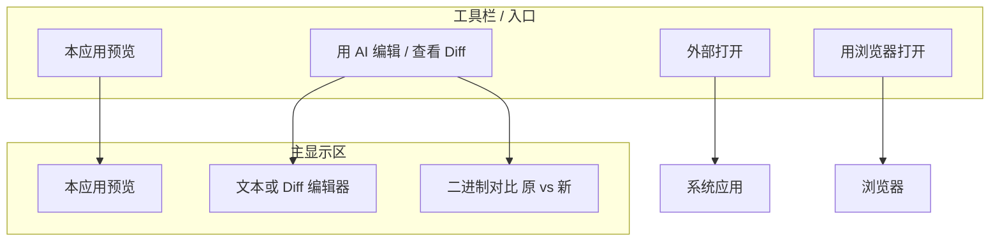

# 文档显示与 AI 编辑：最合理的显示区域安排方案

## 一、目标与原则

- **Agent OS 定位**：比传统编辑器更强在「AI 参与编辑、批量处理、diff 决策」，不强在「重做一套 Word/Excel」。
- **成本平衡**：不重复实现已有办公软件；用「内嵌预览 + 外部应用 + 代码/工具」组合，获得编辑能力。
- **显示区域**：同一块主显示区，根据格式与用户意图在「谁在渲染」上切换，而不是堆叠多套编辑器。

---

## 二、三种显示策略（与 Cursor 等一致）

| 策略 | 含义 | 适用场景 | 成本 |
|------|------|----------|------|
| **A. 本应用内预览** | 用我们自己的 Viewer（mammoth/react-pdf/SheetJS 等）在编辑区 Tab 里渲染 | 快速浏览、不离开工作流、AI 产出后立刻看到 | 已有；仅需优化样式 |
| **B. 系统/办公软件打开** | 用系统默认应用打开（Word/Excel/WPS/预览等），Electron `openPath` | 需要完整版式、复杂排版、或用户习惯在 Office 里改 | 已有「外部打开」按钮 |
| **C. 浏览器中查看** | 新开浏览器 Tab 或内嵌 WebView（如 Office Online、Google Docs 预览链接、本地 file://） | 可选；需要在线协作或 100% 版式时 | 可选实现 |

**结论**：不追求「所有格式都在我们应用里完整可编辑」；编辑能力 = **Agent 用代码/工具改文件** + **用户用我们的预览或外部应用看结果**。

---

## 三、编辑能力从哪来（不重复造轮子）

当前后端已有明确分工（见 `agent_prompts.py` making_changes / document_quality_check）：

- **文本/代码/Markdown**：`edit_file` / `write_file` → 前端 **diff 展示** → 接受并保存。  
  → 显示区 = 我们的编辑器 + Monaco 或内联 diff。
- **Word/Excel/PPT**：**python_run + python-docx / openpyxl / python-pptx** 修改文件；修改后 python_run 验证可打开。  
  → 编辑发生在后端代码；**显示区 = 我们的预览**（或用户点「外部打开」用 Office 看）。

因此：

- **不需要**在应用内再做一套 DOCX/PPT 的 WYSIWYG 编辑器。
- **需要**的是：  
  1）**本应用内预览**尽量好看、统一（字体/暗色/间距）；  
  2）**显眼的「外部打开」**，让「用 Office 精细改」成为一键可达；  
  3）**AI 产出后的统一出口**：要么刷新本应用预览，要么在「有 proposed 新版本」时走 **二进制对比（原 | 新）→ 接受/拒绝**（见下）。

---

## 四、显示区域如何安排（一块主区域 + 明确入口）

显示区域 = **中间编辑区当前 Tab 的主内容**。同一时刻只展示一种内容，避免多套编辑器并排。

- **主显示区**（一个 Tab 内）只做一件事：  
  - 要么是 **本应用预览**（DOCX/PDF/PPT/Excel 的现有 Viewer），  
  - 要么是 **文本/代码 + Diff**（Monaco 或内联 diff），  
  - 要么是 **二进制对比**（左侧原文件预览、右侧 AI 生成版本预览 + 接受/拒绝/另存为）。
- **工具栏 / 入口**（每条 Tab 或 Viewer 顶部）：  
  - **本应用预览**：当前即为此状态；可加「刷新」在 Agent 用 python_run 改完文件后重载。  
  - **外部打开**：已有；调用 `handleOpenExternal` → Electron `openPath`。  
  - **用浏览器打开**（可选）：例如生成 Office Online / Google Docs 的预览链接，或 `file://` 在新窗口；不占主显示区。  
  - **用 AI 编辑 / 查看 Diff**：  
    - 文本/Markdown：打开 diff（现有流程）。  
    - 二进制：若有「AI 生成的新版本」未写盘，则进入「二进制对比」视图；否则提示「已通过 Agent 修改，请刷新预览或外部打开查看」。

这样安排的好处：

- **一块区域**只做「预览」或「diff/对比」一种事，逻辑简单。  
- **不重复实现** Office；精细编辑交给系统应用或浏览器。  
- **比传统编辑器更强**：AI 批量改、diff 决策、统一在同一个工作流里完成。

---

## 五、按格式的推荐组合（显示 + 编辑）

| 格式 | 主显示区默认 | 编辑能力来源 | 可选增强 |
|------|--------------|--------------|----------|
| **DOCX** | 本应用 WordViewer（mammoth→HTML） | python_run + python-docx；或「用 Markdown 编辑」→ 文本 diff → 保存 .md | 二进制对比（当 AI 产出新 docx 且未写盘时） |
| **PDF** | 本应用 PdfPreview | 无直接编辑；AI 若生成新 PDF → 二进制对比 → 接受/另存为 | 保持；不自己做 PDF 编辑 |
| **PPT** | 本应用 PPTViewer（文本预览） | python_run + python-pptx 改内容；用户用「外部打开」看版式 | 若 AI 产出新 pptx 可做二进制对比 |
| **Excel** | 本应用 ExcelViewer（SheetJS） | 已有单元格编辑 + 保存；或 python_run + openpyxl 批量改 | 二进制对比（AI 生成新 xlsx 时） |
| **Markdown/文本/代码** | Monaco 或 Milkdown | edit_file / write_file + diff → 接受并保存 | 已有 |

---

## 六、是否「最合理」的简要结论

- **显示**：以「本应用内预览」为主、**外部打开**为补充、浏览器为可选，是合理且成本最低的。  
- **编辑**：依赖 **Agent（python_run / write_file / write_file_binary）+ 现有办公软件/预览**，不在应用内重做 Office，是合理的。  
- **显示区域**：**一块主显示区** 只做「预览 / 文本 diff / 二进制对比」之一，通过工具栏切换「本应用预览 / 外部打开 / 用 AI 编辑或查看 diff」，是清晰且可实现的。

在此基础上，优先做 **Phase 1（本应用预览样式统一与暗色）** 和 **Phase 2（二进制写入 + 二进制对比视图）**，即可在不大幅增加成本的前提下，把「美观浏览 + AI 编辑生成 diff」闭环打通；如需再增强「用浏览器打开」或 DOCX 的 md→docx 导出，可放在后续阶段。
